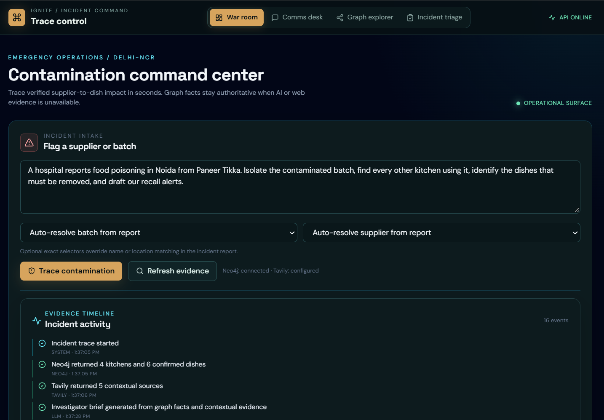
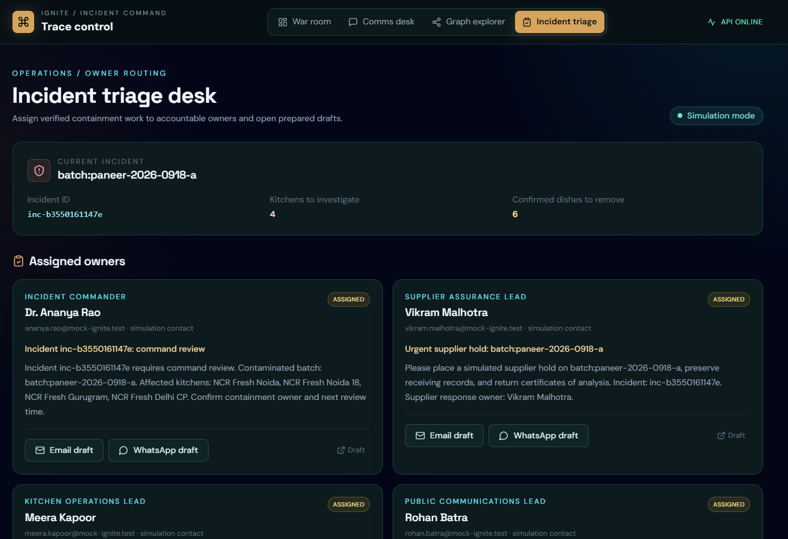
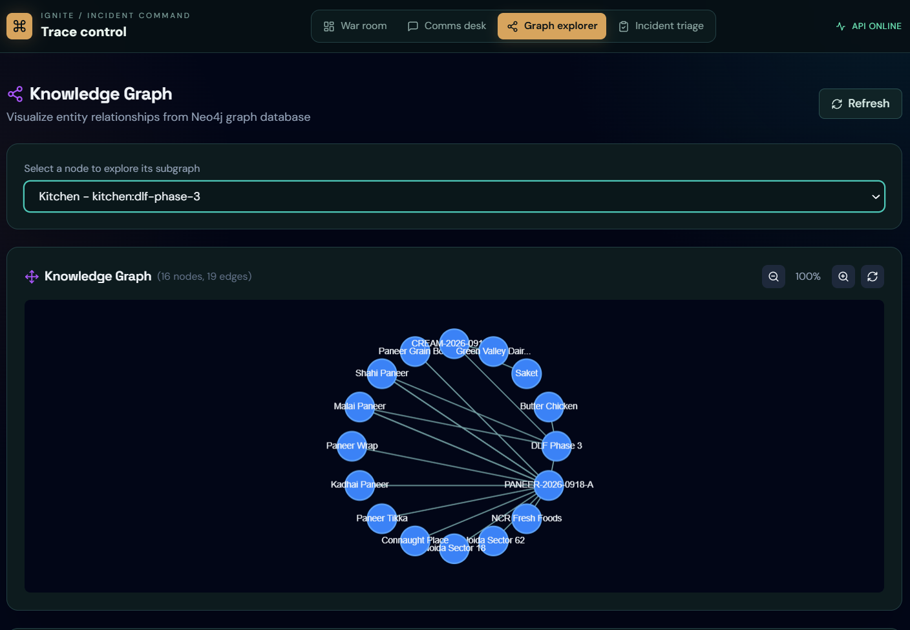
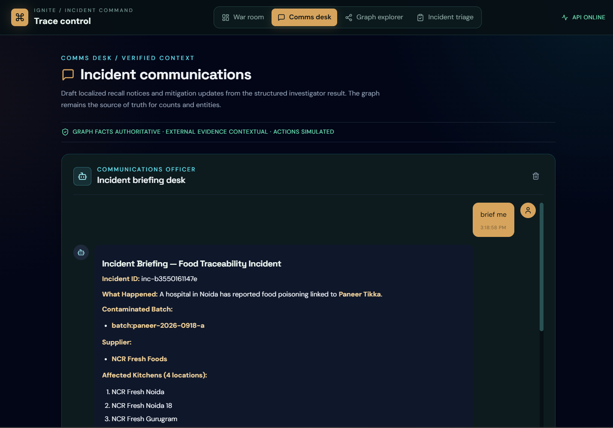
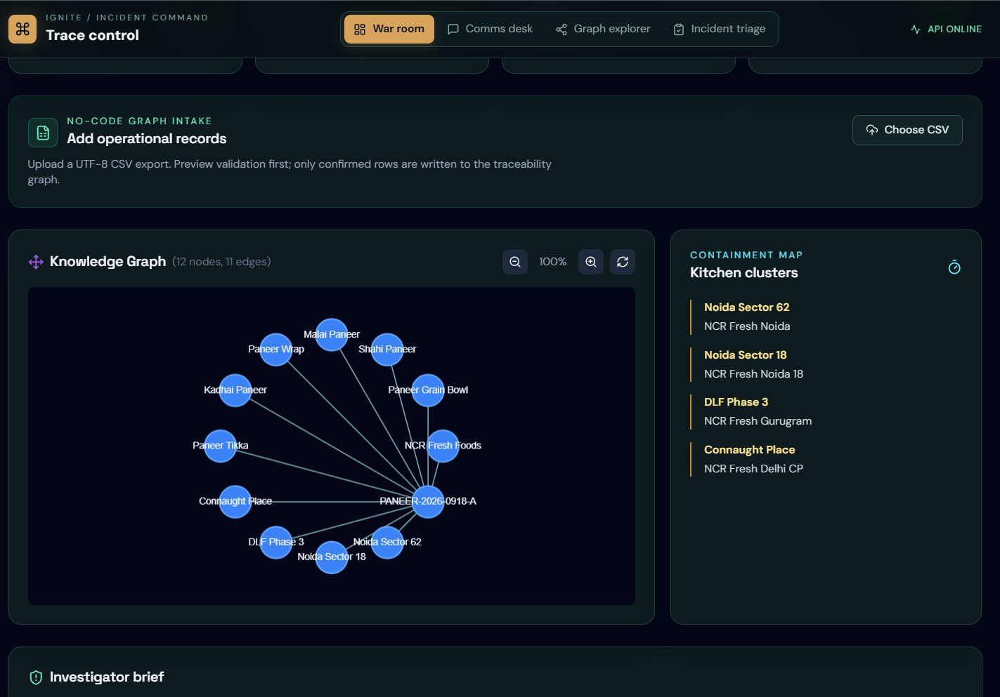

# Trace Control

Trace Control is an Emergency Operations Command Center for food-safety incidents across Delhi-NCR cloud kitchens. It turns a natural-language contamination report into a verified Supplier -> Batch -> Kitchen -> Dish blast radius, contextual evidence, a mitigation brief, recovery suggestions, and an auditable response workflow.

Built for the Ignite-with-Delhi Hackathon.

## Tech Stack

- **Backend:** FastAPI, Python, Pydantic v2
- **Frontend:** React, Vite, TailwindCSS
- **Graph:** Neo4j AuraDB with parameterized Cypher
- **Agent context:** LangChain and OpenAI-compatible providers
- **Evidence:** Tavily web search
- **Deployment:** Render web services, static site, and optional Workflow

## Quick Start

### Prerequisites

- Python 3.11+
- Node.js 18+
- Neo4j AuraDB credentials
- Optional Tavily and OpenAI-compatible provider keys

### Setup

**Windows:**
```bash
setup.bat
```

**Mac/Linux:**
```bash
bash setup.sh
```

The setup script creates `venv`, installs backend dependencies, and installs frontend dependencies.

### Configuration

1. **Backend environment:**
   ```bash
   cp backend/.env.example backend/.env
   # Edit backend/.env with your API keys
   ```

2. **Frontend environment:**
   ```bash
   cp frontend/.env.example frontend/.env.local
   # Edit if needed; the Vite proxy targets localhost:8000 by default
   ```

### Running the Application

**Windows:**
```bash
start.bat
```

**Mac/Linux:**
```bash
bash start.sh
```

Or manually:

```bash
# Terminal 1 - Backend
cd backend
../venv/bin/python -m uvicorn main:app --reload --port 8000  # Mac/Linux
# Windows PowerShell: ..\venv\Scripts\python.exe -m uvicorn main:app --reload --port 8000

# Terminal 2 - Frontend
cd frontend
npm run dev
```

**Local access points:**
- Frontend: http://localhost:5173
- Backend API: http://localhost:8000
- API Documentation: http://localhost:8000/docs

## Core Workflow

1. Submit an incident such as: `A hospital reports food poisoning in Noida from Paneer Tikka. Isolate the batch and find every affected kitchen and dish.`
2. The backend resolves the incident and traces the authoritative Neo4j graph.
3. The dashboard shows the blast radius across Noida, Gurugram, and Delhi, including graph paths and node details.
4. Tavily adds contextual public evidence without changing graph counts.
5. LangChain produces a streamed incident brief and mitigation plan from verified facts.
6. Operators can review read-only replacement suggestions and explicitly confirm simulated actions.
7. CSV intake lets operators preview and confirm graph records without writing Cypher.

Neo4j facts remain authoritative. Provider failures preserve the graph result and display a structured fallback. Menu disablement, kitchen quarantine, and supplier-payment holds are simulations only and create audit events.

## Project Structure

```
repository-root/
├── backend/
│   ├── app/
│   │   ├── api/               # API routes
│   │   ├── core/              # Config, settings
│   │   ├── models/            # Pydantic schemas
│   │   └── services/          # Tavily, Neo4j, LangChain
│   ├── main.py                # FastAPI entry
│   ├── requirements.txt       # Python deps
│   └── .env.example           # Env template
├── frontend/
│   ├── src/
│   │   ├── components/        # React components
│   │   ├── pages/             # Route pages
│   │   ├── hooks/             # Custom hooks
│   │   └── lib/               # API client
│   ├── package.json
│   └── .env.example
├── setup.bat / setup.sh       # One-time setup
├── start.bat / start.sh       # Quick start
├── workflows/                 # Optional Render Workflow tasks
└── render.yaml                # Deployment config
```

The local `venv/`, `node_modules/`, build output, logs, and environment files are generated locally and should not be committed.

## Features

### 1. Contamination command center
- Natural-language incident intake
- Bounded Supplier -> Batch -> Kitchen -> Dish tracing
- Geography clusters for Noida, Gurugram, and Delhi
- Dynamic blast-radius metrics and node inspector

### 2. Evidence and response
- Tavily source enrichment with provider status
- Streamed progress and incident summaries
- Activity timeline and provenance
- Read-only healthy replacement suggestions

### 3. Safe operations
- Explicitly confirmed simulated operational actions
- Audit events for every simulation
- Secure text-to-Cypher rejection boundary
- Fallback behavior when Neo4j, Tavily, or the LLM is unavailable

### 4. No-code ingestion
- UTF-8 CSV preview and validation
- Confirmed server-owned graph import
- Optional Render Workflow for asynchronous ingestion

## API Endpoints

| Endpoint | Method | Description |
|----------|--------|-------------|
| `/api/v1/health` | GET | Health check |
| `/api/v1/analyze` | POST | Analyze query with AI |
| `/api/v1/analyze/stream` | POST | Stream safe incident progress |
| `/api/v1/chat` | POST | Chat with agent |
| `/api/v1/chat/stream` | POST | Stream chat responses |
| `/api/v1/search` | POST | Web search via Tavily |
| `/api/v1/graph/nodes` | GET | Get graph nodes |
| `/api/v1/graph/overview` | GET | Get the traceability graph |
| `/api/v1/graph/subgraph` | GET | Get node subgraph |
| `/api/v1/ingestion/preview` | POST | Validate a CSV without writing |
| `/api/v1/ingestion/import` | POST | Confirm and import CSV records |
| `/api/v1/ingestion/workflow` | GET | Check optional Workflow availability |
| `/api/v1/incidents/{incident_id}/events` | GET | Read incident activity |
| `/api/v1/incidents/{incident_id}/alternatives` | GET | Read replacement suggestions |
| `/api/v1/incidents/{incident_id}/actions` | POST | Confirm a simulated action |

## Deployment

### Render

The repository includes `render.yaml` for:

- `ignite-agent-api`: FastAPI web service
- `ignite-agent-web`: Vite static site
- `ignite-agent-ingestion`: optional Python Render Workflow

From Render, create a Blueprint from the public GitHub repository. The Blueprint file is at the repository root, so no subdirectory root is required. Configure the API secrets in the Render dashboard. Keep `RENDER_API_KEY` server-side; never expose it through Vite.

The synchronous CSV import remains available locally and in production. The optional Workflow is enabled only when `RENDER_API_KEY` and `RENDER_WORKFLOW_TASK_SLUG` are configured.

### Manual Deployment

Run the applications locally from two terminals after completing setup.

**Backend API:**

Windows PowerShell:
```powershell
cd backend
..\venv\Scripts\python.exe -m uvicorn main:app --host 127.0.0.1 --port 8000
```

Mac/Linux:
```bash
cd backend
../venv/bin/python -m uvicorn main:app --host 127.0.0.1 --port 8000
```

**Frontend:**
```bash
cd frontend
npm run dev
```

Open http://localhost:5173 after both processes are running. The backend API and documentation are available at http://localhost:8000 and http://localhost:8000/docs.

## Screenshots

The submission gallery below shows the captured UI states. Screenshot routes and filenames are listed in [`docs/screenshots/README.md`](docs/screenshots/README.md).

### Dashboard



### Triage



### Graph Explorer



### Incident Chat



### CSV Ingestion



## Environment Variables

### Backend (.env)
```bash
OPENAI_API_KEY=sk-...
OPENAI_MODEL=gpt-4o-mini
OPENAI_BASE_URL=https://openrouter.ai/api/v1
TAVILY_API_KEY=tvly-...
NEO4J_URI=neo4j+s://...
NEO4J_USERNAME=neo4j
NEO4J_PASSWORD=...
NEO4J_DATABASE=neo4j
NEO4J_TRUST_ALL_CERTIFICATES=false
CORS_ORIGINS=["http://localhost:5173"]

# Optional server-only Render Workflow integration
RENDER_API_KEY=
RENDER_WORKFLOW_TASK_SLUG=ignite-agent-ingestion/ingest_traceability_rows
```

### Frontend (.env.local)
```bash
VITE_API_URL=http://localhost:8000
```

## License

Owner: debjeetism
Built for Ignite-with-Delhi Hackathon by Debjeet
